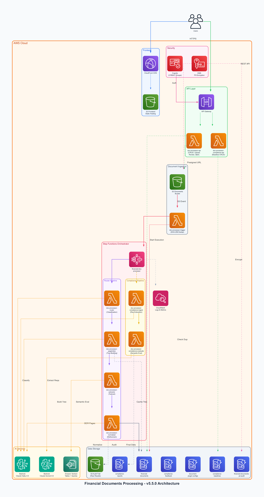
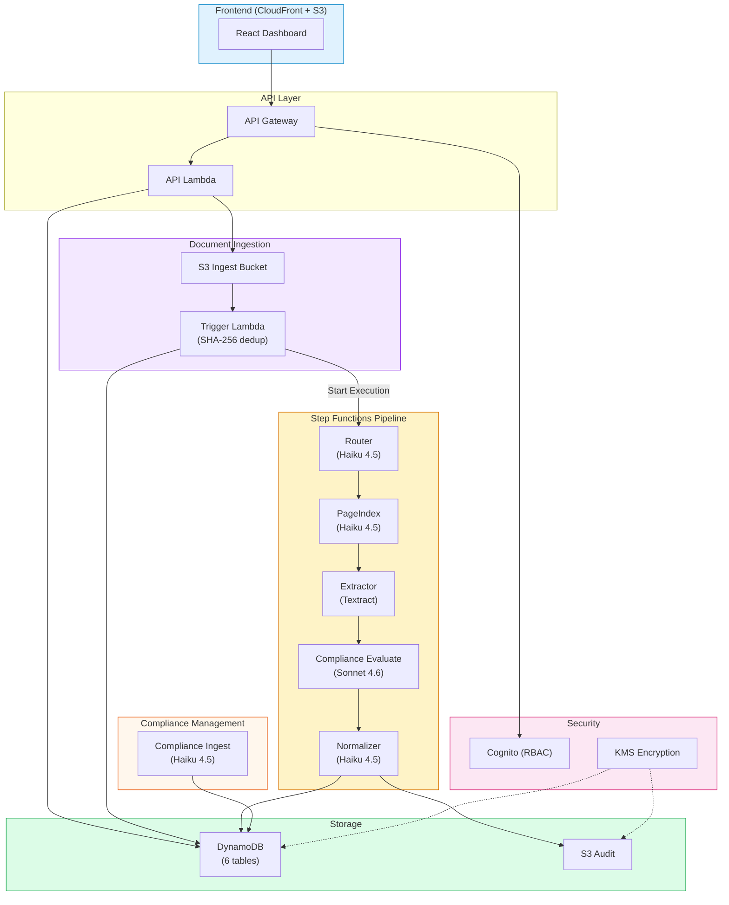
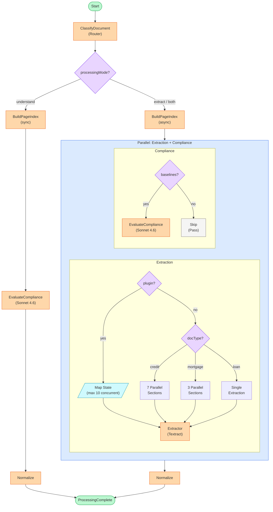
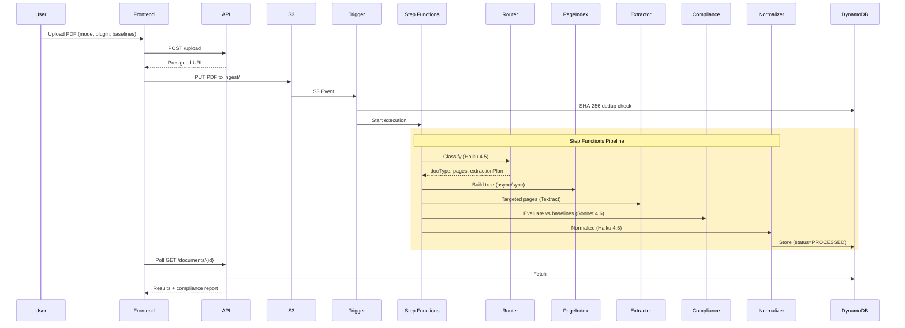
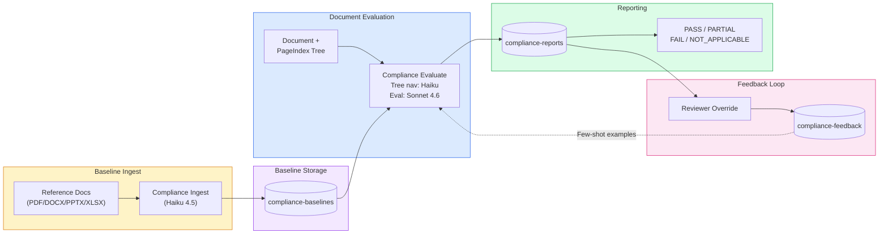
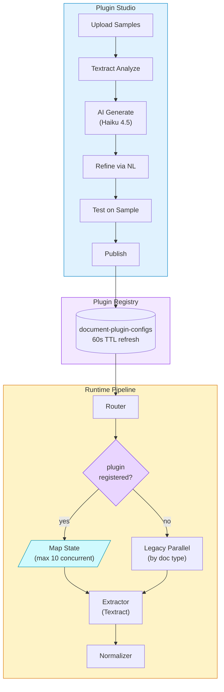

# Financial Documents Processing

## Router Pattern — Cost-Optimized Intelligent Document Processing

A production-ready AWS serverless system for processing high-volume financial documents (Loan Packages, Credit Agreements, BSA/KYC Compliance) with a plugin architecture, semantic compliance engine, three processing modes (extract, understand, both), and a React dashboard — all at ~$0.42/doc.



### Key Features

| Feature | Description |
|---------|-------------|
| Cost Optimization | ~$0.42/doc via Router Pattern vs $4.55+ brute-force alternatives |
| Plugin Architecture | 2 files per document type (`types/*.py` + `prompts/*.txt`) |
| Compliance Engine | Semantic evaluation with Sonnet 4.6, evidence grounding, learning loop |
| Processing Modes | Extract (Textract), Understand (compliance-only), Both (parallel) |
| PageIndex Tree | Hierarchical document navigation, on-demand summaries, section-aware Q&A |
| Human Review | Approve/reject/correct workflow with Cognito RBAC |
| Document Deduplication | SHA-256 content hashing prevents reprocessing |
| Real-time Pipeline Tracking | Live stage progress with processing events |
| PII Encryption | KMS envelope encryption for sensitive financial data |

## Architecture

### System Overview



### Processing Pipeline



### Data Flow



### Compliance Engine



### Plugin Architecture



> New document type = 2 files: `types/{type}.py` + `prompts/{type}.txt`

## Supported Document Types

- **Loan Packages**: Promissory Note, Closing Disclosure (TILA-RESPA), Form 1003
- **Credit Agreements**: Agreement Info, Parties, Facility Terms, Rates, Lender Commitments, Covenants
- **Custom Documents**: Any type via Plugin Studio (upload samples, AI-generate config)
- **Unknown Documents**: PageIndex tree for hierarchical browsing and Q&A

## Quick Start

### Prerequisites

- Node.js 18+, Python 3.13+, AWS CLI configured, [uv](https://github.com/astral-sh/uv)

### Deploy

```bash
git clone https://github.com/vibhupb/financial-documents-processing.git
cd financial-documents-processing
npm install                         # CDK dependencies
cd frontend && npm install && cd .. # Frontend dependencies
./scripts/deploy.sh --force         # Full deploy (backend + frontend)
```

Individual deploys: `./scripts/deploy-backend.sh` (Lambda/CDK) | `./scripts/deploy-frontend.sh` (React + S3 + CloudFront)

### Upload a Document

1. Open CloudFront URL from deploy output
2. Navigate to Upload page
3. Drop a PDF — select processing mode, plugin, and compliance baselines
4. Monitor real-time pipeline progress

## Project Structure

```
├── bin/app.ts                          # CDK entry point
├── lib/stacks/                         # CDK stack definitions
├── lambda/
│   ├── api/                            # REST API (CRUD, upload, review, compliance)
│   ├── trigger/                        # S3 event → SHA-256 dedup → Step Functions
│   ├── router/                         # Classification (Claude Haiku 4.5)
│   ├── extractor/                      # Textract targeted extraction
│   ├── normalizer/                     # Data normalization (Claude Haiku 4.5)
│   ├── pageindex/                      # Hierarchical tree builder + Q&A
│   ├── compliance-ingest/              # Parse reference docs, extract requirements
│   ├── compliance-evaluate/            # LLM evaluation with evidence grounding
│   ├── compliance-api/                 # Compliance baseline CRUD
│   └── layers/
│       ├── plugins/                    # Plugin registry + doc type configs
│       └── compliance-parsers/         # DOCX/PPTX/XLSX parsers
├── frontend/src/
│   ├── pages/                          # Dashboard, Upload, Documents, WorkQueue, Baselines
│   ├── components/                     # DocumentViewer, ComplianceTab, PipelineTracker
│   └── services/api.ts                # TanStack Query API client
├── tests/
│   ├── unit/                           # pytest (80+ tests)
│   ├── integration/                    # Real-AWS API tests (9 tests)
│   └── e2e/                            # Playwright browser tests (8 tests)
├── scripts/                            # deploy, cleanup, test-toolkit
└── docs/                               # ARCHITECTURE.md, VERSION_HISTORY.md
```

## Tech Stack

| Component | Technology | Purpose |
|-----------|-----------|---------|
| Infrastructure | AWS CDK (TypeScript) | Infrastructure as Code |
| Orchestration | AWS Step Functions | Multi-mode document pipeline |
| Storage | Amazon S3 (2 buckets) | Documents + frontend hosting |
| Database | Amazon DynamoDB (6 tables) | Documents, plugins, baselines, reports, feedback, audit |
| Classification | Bedrock Claude Haiku 4.5 | Router — document type detection |
| Extraction | Amazon Textract | Targeted form/table/query extraction |
| Normalization | Bedrock Claude Haiku 4.5 | Field mapping and schema compliance |
| Compliance | Bedrock Claude Sonnet 4.6 | Semantic requirement evaluation |
| PageIndex | Bedrock Claude Haiku 4.5 | Hierarchical tree + Q&A |
| API | API Gateway + Lambda (Python 3.13) | 40+ REST endpoints |
| Frontend | React + TypeScript + Vite + Tailwind | Single-page dashboard |
| Auth | Amazon Cognito | RBAC (Admin/Reviewer/Viewer) |
| Encryption | AWS KMS | PII envelope encryption |
| PDF Rendering | react-pdf | In-browser PDF viewer |
| Monitoring | Amazon CloudWatch | Logs, metrics, alarms |

## Documentation

- [Architecture Deep Dive](docs/ARCHITECTURE.md) — cost analysis, API endpoints, DynamoDB schema, security model
- [Version History](docs/VERSION_HISTORY.md) — all releases from v1.0.0 to v5.5.0
- [Credits](docs/CREDITS.md) — open source acknowledgments

## Acknowledgments

| Project | License | Usage |
|---------|---------|-------|
| [VectifyAI/PageIndex](https://github.com/VectifyAI/PageIndex) | MIT | Core tree-building algorithm. Adapted for AWS Bedrock with async processing. |
| [GAIK](https://github.com/Sankgreall/GAIK) | MIT | Inspired double-pass text extraction (PyPDF + PyMuPDF fallback). |
| [PyPDF](https://github.com/py-pdf/pypdf) | BSD-3 | Primary PDF text extraction. |
| [PyMuPDF](https://github.com/pymupdf/PyMuPDF) | AGPL-3.0 | Secondary extraction for scanned/custom-font PDFs. |
| [react-pdf](https://github.com/wojtekmaj/react-pdf) | MIT | In-browser PDF rendering. |

## License

MIT License
