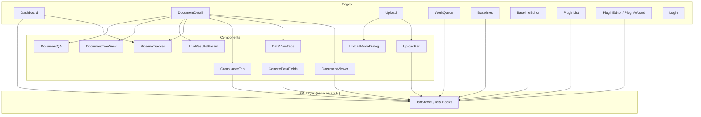
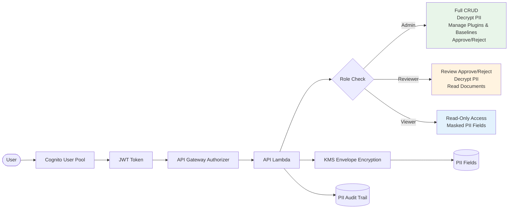

# Architecture Deep Dive

> Detailed technical architecture for the Financial Documents Processing system (v5.5.0).

## Cost Analysis

Per-document cost breakdown at **~$0.42/doc** (v5.5.0):

| Step | Service | Cost/Doc | Notes |
|------|---------|----------|-------|
| Classification | Bedrock Haiku 4.5 | ~$0.003 | Single prompt, ~2K tokens |
| Page Indexing | Bedrock Haiku 4.5 | ~$0.05 | Hierarchical tree builder, multi-turn |
| Extraction | Amazon Textract | ~$0.015/page | AnalyzeDocument (Forms + Tables) |
| Normalization | Bedrock Haiku 4.5 | ~$0.01 | Template-based structured output |
| Compliance Eval | Bedrock Sonnet 4.6 | ~$0.18 | Semantic evaluation per requirement batch |
| PageIndex Costs | Bedrock Haiku 4.5 | ~$0.05 | Tree navigation for compliance |
| Lambda + Step Functions + Storage | AWS | ~$0.002 | Invocations, state transitions, S3/DDB |
| **Total** | | **~$0.42** | |

**Monthly projections:**

| Volume | Monthly Cost | Cost/Doc |
|--------|-------------|----------|
| 100 docs | $42 | $0.42 |
| 1,000 docs | $420 | $0.42 |
| 10,000 docs | $4,200 | $0.42 |

> **Note:** v5.5.0 added PageIndex and compliance evaluation costs (up from ~$0.34 in v5.3.0).
> Compliance-only mode (`understand`) skips extraction, reducing cost to ~$0.29/doc.
> Extract-only mode (no baselines) skips compliance, reducing cost to ~$0.08/doc.

## Why Router Pattern?

The Router Pattern uses the **cheapest model that can do the job** at each step, reserving expensive models only where semantic reasoning is required (compliance evaluation).

| Approach | Cost/Doc | Classification | Extraction | Compliance | Notes |
|----------|----------|---------------|------------|------------|-------|
| **Router Pattern** | **$0.42** | Haiku 4.5 | Textract | Sonnet 4.6 | This system |
| Opus End-to-End | $4.55 | Opus | Opus | Opus | Single-model, highest quality |
| Bedrock Document Automation | $2.10 | BDA | BDA | N/A | AWS managed, no compliance |
| GPT-4 End-to-End | $3.20 | GPT-4 | GPT-4 | GPT-4 | OpenAI, single-model |
| Brute-Force Haiku | $0.90 | Haiku | Haiku | Haiku | Cheap but low compliance accuracy |

**Key insight:** Classification and normalization are straightforward tasks -- a $0.003 Haiku call achieves 98%+ accuracy routing documents to the correct plugin. Textract handles structured extraction at $0.015/page (far cheaper than any LLM). The only step requiring an expensive model is compliance evaluation, where semantic understanding of regulatory intent matters. By using Sonnet 4.6 *only* for compliance, the Router Pattern achieves near-Opus quality at ~10% of the cost.

**Cost scaling:** At 10,000 docs/month, Router Pattern saves **$41,300/month** compared to Opus end-to-end.

## API Endpoints

### Documents (14 endpoints)

| Method | Endpoint | Description |
|--------|----------|-------------|
| GET | `/documents` | List all documents (paginated) |
| GET | `/documents/{id}` | Full document details with extracted data |
| GET | `/documents/{id}/pdf` | Presigned S3 URL for PDF download |
| GET | `/documents/{id}/status` | Polling endpoint for processing status |
| GET | `/documents/{id}/audit` | PII access audit trail |
| GET | `/documents/{id}/tree` | PageIndex hierarchical tree |
| GET | `/documents/{id}/compliance` | Compliance reports for document |
| GET | `/documents/{id}/compliance/{reportId}` | Single compliance report detail |
| POST | `/documents/{id}/compliance/{reportId}/review` | Reviewer override (PASS/FAIL) per requirement |
| POST | `/documents/{id}/ask` | Hybrid Q&A (PageIndex tree + LLM) |
| POST | `/documents/{id}/section-summary` | Summarize a document section |
| POST | `/documents/{id}/extract` | Trigger deferred extraction |
| PUT | `/documents/{id}/fields` | Update extracted fields (manual correction) |
| POST | `/documents/{id}/reprocess` | Re-run pipeline (accepts baselineIds, processingMode) |

### Upload (1 endpoint)

| Method | Endpoint | Description |
|--------|----------|-------------|
| POST | `/upload` | Get presigned upload URL; accepts `processingMode`, `baselineIds`, `pluginId` |

### Plugins (10 endpoints)

| Method | Endpoint | Description |
|--------|----------|-------------|
| GET | `/plugins` | List registered plugin types |
| POST | `/plugins` | Create new plugin config |
| GET | `/plugins/{id}` | Plugin config detail |
| PUT | `/plugins/{id}` | Update plugin config |
| DELETE | `/plugins/{id}` | Delete plugin config |
| POST | `/plugins/{id}/publish` | Publish draft plugin to active |
| POST | `/plugins/analyze` | Analyze sample PDF for field detection |
| POST | `/plugins/generate` | Generate plugin config from analysis |
| POST | `/plugins/refine` | Refine plugin config with feedback |
| POST | `/plugins/{id}/test` | Test plugin against sample document |

### Compliance Baselines (11 endpoints)

| Method | Endpoint | Description |
|--------|----------|-------------|
| GET | `/baselines` | List compliance baselines |
| POST | `/baselines` | Create new baseline |
| GET | `/baselines/{id}` | Baseline detail with requirements |
| PUT | `/baselines/{id}` | Update baseline metadata |
| DELETE | `/baselines/{id}` | Delete baseline |
| POST | `/baselines/{id}/publish` | Publish baseline to active |
| POST | `/baselines/{id}/requirements` | Add requirement |
| PUT | `/baselines/{id}/requirements/{reqId}` | Update requirement |
| DELETE | `/baselines/{id}/requirements/{reqId}` | Delete requirement |
| POST | `/baselines/{id}/upload-reference` | Upload reference document (PDF/DOCX/PPTX/XLSX) |
| POST | `/baselines/{id}/generate-requirements` | AI-generate requirements from reference docs |

### Review (4 endpoints)

| Method | Endpoint | Description |
|--------|----------|-------------|
| GET | `/review` | Documents pending review |
| GET | `/review/{id}` | Review detail |
| POST | `/review/{id}/approve` | Approve document |
| POST | `/review/{id}/reject` | Reject document with reason |

### Miscellaneous (2 endpoints)

| Method | Endpoint | Description |
|--------|----------|-------------|
| GET | `/metrics` | Dashboard metrics (counts, avg processing time) |
| POST | `/documents/build-tree` | On-demand PageIndex tree building (async) |

## Performance Optimization

### Lambda Configuration

| Lambda | Memory | Timeout | Concurrency | Purpose |
|--------|--------|---------|-------------|---------|
| `doc-processor-api` | 1 GB | 60s | On-demand | REST API handler |
| `doc-processor-trigger` | 512 MB | 60s | On-demand | S3 event dedup + Step Functions start |
| `doc-processor-router` | 2 GB | 5 min | On-demand | Bedrock Haiku classification |
| `doc-processor-pageindex` | 3 GB | 10 min | On-demand | Hierarchical tree builder |
| `doc-processor-extractor` | 2 GB | 10 min | On-demand | Textract targeted extraction |
| `doc-processor-normalizer` | 2 GB | 5 min | On-demand | Data normalization + final write |
| `doc-processor-compliance-ingest` | 2 GB | 5 min | On-demand | Parse reference docs, extract requirements |
| `doc-processor-compliance-evaluate` | 2 GB | 10 min | On-demand | Sonnet 4.6 semantic evaluation |
| `doc-processor-compliance-api` | 512 MB | 30s | On-demand | Compliance CRUD operations |

### Processing Times (typical 20-page document)

| Stage | Duration | Notes |
|-------|----------|-------|
| Router (Classification) | 1-3s | Single Haiku prompt |
| PageIndex (Tree Build) | 15-45s | Async in extract mode, sync in understand mode |
| Extractor (Textract) | 10-30s | Parallel page processing |
| Compliance Evaluate | 30-120s | 3 parallel workers, batched requirements |
| Normalizer | 3-8s | Template rendering + DynamoDB write |
| **End-to-end (extract)** | **30-90s** | PageIndex runs async alongside extraction |
| **End-to-end (understand)** | **60-180s** | PageIndex sync + compliance evaluation |

### Optimization Techniques

- **Async PageIndex**: In extract mode, PageIndex runs in parallel with extraction (not blocking)
- **Parallel compliance**: 3 worker threads evaluate requirement batches concurrently
- **Parallel ingest**: Compliance-ingest uses 3 doc workers + 5 section workers
- **Haiku for navigation**: Tree traversal uses Haiku 4.5; Sonnet 4.6 reserved for evaluation only
- **SHA-256 dedup**: Trigger Lambda skips duplicate uploads via content hash index
- **Adaptive retry**: Bedrock calls use adaptive retry with 120s read timeout
- **Plugin TTL refresh**: Dynamic plugins re-read every 60s (avoids cold-start registry misses)

## DynamoDB Schema

All tables use `PAY_PER_REQUEST` billing and have Point-in-Time Recovery (PITR) enabled.

### `financial-documents`

| Attribute | Role |
|-----------|------|
| `documentId` | Partition Key (PK) |

| GSI | PK | SK | Purpose |
|-----|----|----|---------|
| `StatusIndex` | `status` | `uploadTimestamp` | Filter by processing status |
| `ContentHashIndex` | `contentHash` | -- | SHA-256 dedup lookups |
| `ReviewStatusIndex` | `reviewStatus` | `uploadTimestamp` | Work queue filtering |

### `compliance-baselines`

| Attribute | Role |
|-----------|------|
| `baselineId` | Partition Key (PK) |

| GSI | PK | Purpose |
|-----|----|----|
| `pluginId-index` | `pluginId` | Find baselines for a plugin type |

### `compliance-reports`

| Attribute | Role |
|-----------|------|
| `reportId` | Partition Key (PK) |
| `documentId` | Sort Key (SK) |

| GSI | PK | Purpose |
|-----|----|----|
| `documentId-index` | `documentId` | All reports for a document |
| `baselineId-index` | `baselineId` | All reports for a baseline |

### `compliance-feedback`

| Attribute | Role |
|-----------|------|
| `feedbackId` | Partition Key (PK) |
| `baselineId` | Sort Key (SK) |

| GSI | PK | Purpose |
|-----|----|----|
| `requirementId-index` | `requirementId` | Feedback history per requirement |

### `document-plugin-configs`

| Attribute | Role |
|-----------|------|
| `pluginId` | Partition Key (PK) |
| `version` | Sort Key (SK) |

| GSI | PK | Purpose |
|-----|----|----|
| `StatusIndex` | `status` | List active/draft plugins |

### `financial-documents-pii-audit`

| Attribute | Role |
|-----------|------|
| `documentId` | Partition Key (PK) |
| `accessTimestamp` | Sort Key (SK) |

| GSI | PK | Purpose |
|-----|----|----|
| `AccessorIndex` | `accessorId` | Audit trail by user (7-year retention) |

## Frontend Component Map

**Key patterns:**
- **TanStack Query** manages all server state (caching, polling, mutations)
- **DocumentViewer** renders PDFs with click-to-jump navigation via `_sectionPageMap`
- **DataViewTabs** conditionally shows tabs based on `processingMode` (extract hides Compliance, understand hides Extracted/JSON)
- **UploadModeDialog** presents mode selection (Extract/Compliance/Both), plugin dropdown, and baseline checkboxes
- **PipelineTracker** shows 4 stages with color-coded progress (amber for compliance, cyan for indexing)

## Security & Auth

### Role-Based Access Control (RBAC)

| Role | Documents | PII | Plugins & Baselines | Review |
|------|-----------|-----|---------------------|--------|
| **Admin** | Full CRUD | Decrypt | Create/Edit/Publish/Delete | Approve/Reject |
| **Reviewer** | Read | Decrypt | Read-only | Approve/Reject |
| **Viewer** | Read | Masked | Read-only | None |

### Encryption

- **KMS Envelope Encryption**: PII fields (SSN, account numbers, names) encrypted at rest with per-document data keys
- **PII Audit Trail**: Every decryption logged to `financial-documents-pii-audit` table with accessor ID, timestamp, and purpose
- **7-year retention**: Audit records retained for regulatory compliance (BSA/KYC)
- **`safe_log()` module**: All Lambda logging uses safe_log to redact PII before writing to CloudWatch

### Auth Toggle

- `REQUIRE_AUTH` environment variable controls authentication enforcement
- When disabled (development), API Gateway skips Cognito authorizer
- Frontend checks `VITE_REQUIRE_AUTH` to show/hide login flow

## Environment Variables

### Backend (Lambda)

| Variable | Description | Used By |
|----------|-------------|---------|
| `BUCKET_NAME` | S3 bucket for document storage | All Lambdas |
| `TABLE_NAME` | DynamoDB `financial-documents` table | All Lambdas |
| `STATE_MACHINE_ARN` | Step Functions state machine ARN | Trigger |
| `CORS_ORIGIN` | Allowed CORS origin (CloudFront URL) | API |
| `BEDROCK_MODEL_ID` | Default Bedrock model (Haiku 4.5) | Router, Normalizer, PageIndex |
| `COMPLIANCE_BASELINES_TABLE` | DynamoDB `compliance-baselines` table | Compliance Lambdas, API |
| `COMPLIANCE_REPORTS_TABLE` | DynamoDB `compliance-reports` table | Compliance Lambdas, API |
| `COMPLIANCE_FEEDBACK_TABLE` | DynamoDB `compliance-feedback` table | Compliance Lambdas, API |
| `PLUGIN_CONFIGS_TABLE` | DynamoDB `document-plugin-configs` table | Router, API, Plugin Lambdas |
| `PII_ENCRYPTION_KEY_ID` | KMS key ID for PII envelope encryption | API, Normalizer |
| `REQUIRE_AUTH` | Enable/disable Cognito auth (`true`/`false`) | API |

### Frontend (Vite)

| Variable | Description | Set By |
|----------|-------------|--------|
| `VITE_API_URL` | API Gateway endpoint URL | `deploy-frontend.sh` (auto-detected from CDK outputs) |
| `VITE_COGNITO_USER_POOL_ID` | Cognito User Pool ID | `deploy-frontend.sh` (auto-detected from CDK outputs) |
| `VITE_COGNITO_CLIENT_ID` | Cognito App Client ID | `deploy-frontend.sh` (auto-detected from CDK outputs) |
| `VITE_REQUIRE_AUTH` | Show login UI (`true`/`false`) | `deploy-frontend.sh` |

> All frontend variables are baked into the Vite build at compile time and served as static assets via CloudFront.
> Backend variables are injected by CDK at deploy time via Lambda environment configuration.
